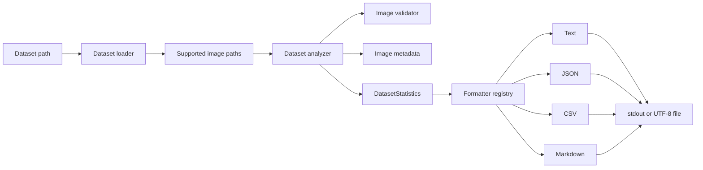

# Architecture

## High-level architecture

Poseidon AI is organized as a Python package under `src/poseidon_ai`.
Nautilus Vision is the implemented computer-vision and dataset-engineering
component. Its dataset path is deliberately split into discovery, validation,
metadata extraction, aggregation, and presentation.



The same flow in words: the CLI accepts a dataset directory, the loader
returns supported candidate paths, the analyzer validates each path and
collects metadata for valid images, and a selected formatter renders the
result for standard output or a file.

## Component responsibilities

### Dataset loader

`nautilus_vision/dataset_loader.py` checks that the dataset path exists and is
a directory. It discovers regular files with supported suffixes and returns
them in deterministic, case-insensitive relative-path order. The loader API
supports both recursive and non-recursive discovery plus optional validation.
The dataset-summary CLI keeps non-recursive discovery as its default and
exposes recursive discovery through `--recursive`.

### Image validator

`nautilus_vision/image_validator.py` checks:

- path existence;
- membership in the supported-extension set;
- whether OpenCV can decode the file;
- minimum width and height, both 32 pixels by default.

`DEFAULT_MIN_WIDTH` and `DEFAULT_MIN_HEIGHT` define those shared defaults.
Callers can supply independent threshold values, while dimension checks and
their ordered validation errors remain owned by the image validator.

It returns an `ImageValidationResult` containing validity, error messages,
and decoded dimensions and channel count when available.

### Image metadata utilities

`nautilus_vision/image_metadata.py` decodes one image and returns its
filename, width, height, channel count, and on-disk byte size.
`nautilus_vision/image_loader.py` provides the lower-level operation that
loads an image into a NumPy array. Both raise `FileNotFoundError` when OpenCV
cannot load the requested image.

### Dataset analyzer

`nautilus_vision/dataset_analyzer.py` coordinates discovery and validation.
It counts every supported candidate, normalizes and counts its extension,
records invalid-image diagnostics, and collects size and dimension data for
valid images. It also aggregates the decoded channel count already present in
each valid image's metadata. From the same metadata result, it calculates
each valid image's actual `width * height` pixel area and aggregates minimum,
maximum, and arithmetic mean pixel counts. Neither statistic adds another
metadata request or image decode. Its keyword-only minimum width and height
default to the validator constants and are forwarded directly to
`validate_image`.

`total_size_bytes` is the sum of valid-image file sizes. Invalid candidates
still contribute to `total_images` and `extension_counts`, but not to channel
or resolution statistics.

### `DatasetStatistics`

`nautilus_vision/dataset_statistics.py` defines the mutable aggregate passed
from analysis to presentation. It contains dataset identity, valid and
invalid counts, dimensions, valid-image bytes, normalized extension counts,
numeric decoded channel counts for valid images, and invalid-image
diagnostics. It also retains raw minimum, maximum, and average valid-image
pixel counts. Megapixel values are not duplicated in the model. Collection
fields use independent default factories. The model keeps channel keys as
integers and does not attach inferred colour semantics.

### `InvalidImageDiagnostic`

`InvalidImageDiagnostic` is an immutable value with an image `Path` and a
tuple of validation error strings. The analyzer creates one entry for each
invalid supported candidate. Report formatters expose the portable image path
and all captured errors without reading or validating the image again.

### Text and JSON formatters

`nautilus_vision/dataset_summary.py` contains the human-readable text
formatter and JSON formatter. Text uses uppercase image-format labels and a
numeric Image Channels section, followed by Image Resolution and diagnostics
grouped under portable paths and a formatted size. JSON preserves normalized
lowercase extension keys, converts numerically ordered channel keys to
strings, includes structured pixel and megapixel statistics plus raw and
formatted sizes, and represents diagnostics as explicit dictionaries with
error arrays.

### Shared dataset serialization

`nautilus_vision/dataset_serialization.py` provides the shared deterministic
structures used by JSON and CSV. Resolution serialization retains raw pixel
counts and derives decimal megapixels using `pixel_count / 1_000_000`, rounded
to six decimal places. It does not mutate `DatasetStatistics`.

### CSV formatter

`nautilus_vision/dataset_csv.py` uses `csv.writer` and `io.StringIO`. It has a
stable fifteen-column schema. The `extension_counts`, `channel_counts`, and
`resolution_statistics` cells are JSON objects, and
`invalid_image_diagnostics` is a JSON array in one cell. They are serialized
with `json.dumps`, so formats do not create dynamic columns and commas and
quotation marks are correctly escaped.

### Markdown formatter

`nautilus_vision/dataset_markdown.py` renders Overview, Image Formats, Image
Channels, Image Resolution, Invalid Image Diagnostics, Width, Height, and
Dataset Size sections. Diagnostic paths use portable separators and safe
code-span delimiters, and error bullets escape Markdown punctuation.

### Formatter registry

`FORMATTER_REGISTRY` in `dataset_summary.py` maps `text`, `json`, `csv`, and
`markdown` to callables with the same `(Path, DatasetStatistics) -> str`
contract. The registry is also the source for argparse's `--format` choices.

### CLI entry module

`dataset_summary.main` is exposed through the installed
`poseidon-dataset-summary` command. The equivalent
`python -m poseidon_ai.nautilus_vision.dataset_summary` invocation remains
supported. Both paths call the same `main()` function and therefore share
argument parsing, formatting, operational error handling, and exit-code
behavior.

The CLI parses the dataset path, output format, legacy `--json` shortcut, and
optional output path. Its `--recursive` boolean is passed directly to the
existing analyzer, which delegates discovery to the loader; the CLI contains
no separate traversal implementation. The CLI also parses positive
`--min-width` and `--min-height` values and forwards them to the analyzer; it
does not perform dimension validation itself. It analyzes once, selects a
formatter, then prints or writes the result. Loaders and analyzers retain
normal Python exception semantics for library callers. At the CLI boundary,
expected dataset and output filesystem failures are translated into concise
standard error messages and status 1. Unexpected programming failures are
not broadly swallowed.

The installed `poseidon-inspect` command is separate and inspects metadata for
one image.

## Why validation and analysis are separate

Validation answers whether an individual image meets current input rules and
returns specific errors. Analysis owns dataset-wide decisions: it discovers
candidates, updates counts, captures invalid diagnostics, and aggregates
metadata. This boundary allows validation to be used independently and keeps
dataset arithmetic out of the image-level validator.

## Why reporting formats are isolated

Analysis produces one structured model. Formatters translate that model
without rediscovering or revalidating files. Isolated formatters keep
presentation-specific concerns—JSON types, CSV escaping, Markdown tables,
and text alignment—out of the analysis path and allow the CLI registry to
select a format consistently. Diagnostic reporting reads the structured
analysis result; it never performs a second validation pass. Channel
statistics likewise use metadata already collected for valid images and do
not trigger another decode. Resolution statistics use that same metadata
result and derive presentation-only megapixels from the model's raw pixel
counts.

## Analyzer invariants

For statistics returned by `analyze_dataset`, the following relationships are
expected:

```text
total_images == valid_images + invalid_images
sum(extension_counts.values()) == total_images
sum(channel_counts.values()) == valid_images
len(invalid_image_diagnostics) == invalid_images
```

When valid images exist, resolution statistics also satisfy:

```text
min_pixel_count <= average_pixel_count <= max_pixel_count
average_pixel_count
    == sum(width * height for every valid image) / valid_images
```

These invariants are analyzer behavior, not validation enforced by the
`DatasetStatistics` dataclass. Callers can manually construct a statistics
object whose fields do not satisfy them.

When no valid images exist, channel counts are empty, all width and height
and pixel-count statistics remain zero, and `total_size_bytes` is zero.
Minimum and maximum pixel counts come from actual per-image areas; the
analyzer never combines independent width and height extrema to fabricate an
area. Channel values describe decoded array channel counts from the current
metadata pipeline, not inferred colour modes.

## Extension normalization

Candidate suffix matching is case-insensitive. The analyzer removes the
leading dot, lowercases the suffix, maps `jpg` to `jpeg` and `tif` to `tiff`,
then sorts the completed mapping by normalized key. Machine-readable reports
retain those lowercase keys. Text and Markdown uppercase them for display.

## Current limitations

- Dataset size excludes invalid supported files.
- There is no model-training, inference, video, or live-camera pipeline.
- Runtime YAML configuration is not present in the tracked repository.

## Planned architectural direction

Planned work is tracked in the [roadmap](roadmap.md). Near-term directions
include richer dataset statistics and manifest export. Training and inference
remain future capabilities rather than part of the current architecture.
