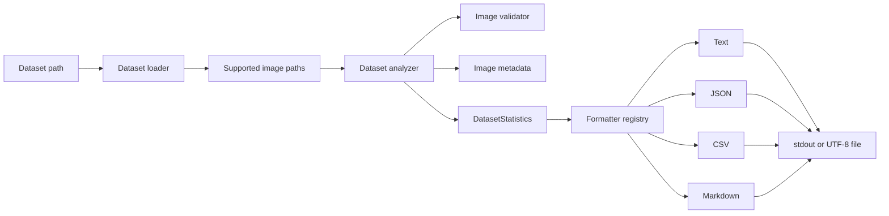

# Architecture

## High-level architecture

Poseidon AI is organized as a Python package under `src/poseidon_ai`.
Nautilus Vision is the implemented computer-vision and dataset-engineering
component. Its dataset path is deliberately split into discovery, validation,
metadata extraction, aggregation, and presentation.



The same flow in words: the CLI accepts a dataset directory, the loader
returns supported candidate paths, the analyzer validates each path and
collects metadata for valid images, and a selected formatter renders the
result for standard output or a file.

## Component responsibilities

### Dataset loader

`nautilus_vision/dataset_loader.py` checks that the dataset path exists and is
a directory. It discovers regular files with supported suffixes and returns
them in deterministic, case-insensitive relative-path order. The loader API
supports recursive discovery and optional validation, although the
dataset-summary CLI currently uses the analyzer defaults: non-recursive
discovery with analyzer-managed validation.

### Image validator

`nautilus_vision/image_validator.py` checks:

- path existence;
- membership in the supported-extension set;
- whether OpenCV can decode the file;
- minimum width and height, both 32 pixels by default.

It returns an `ImageValidationResult` containing validity, error messages,
and decoded dimensions and channel count when available.

### Image metadata utilities

`nautilus_vision/image_metadata.py` decodes one image and returns its
filename, width, height, channel count, and on-disk byte size.
`nautilus_vision/image_loader.py` provides the lower-level operation that
loads an image into a NumPy array. Both raise `FileNotFoundError` when OpenCV
cannot load the requested image.

### Dataset analyzer

`nautilus_vision/dataset_analyzer.py` coordinates discovery and validation.
It counts every supported candidate, normalizes and counts its extension,
records invalid-image diagnostics, and collects size and dimension data for
valid images. It computes minimum, maximum, and arithmetic mean dimensions
when at least one image is valid.

`total_size_bytes` is the sum of valid-image file sizes. Invalid candidates
still contribute to `total_images` and `extension_counts`.

### `DatasetStatistics`

`nautilus_vision/dataset_statistics.py` defines the mutable aggregate passed
from analysis to presentation. It contains dataset identity, valid and
invalid counts, dimensions, valid-image bytes, normalized extension counts,
and invalid-image diagnostics. Collection fields use independent default
factories.

### `InvalidImageDiagnostic`

`InvalidImageDiagnostic` is an immutable value with an image `Path` and a
tuple of validation error strings. The analyzer creates one entry for each
invalid supported candidate. Report formatters expose the portable image path
and all captured errors without reading or validating the image again.

### Text and JSON formatters

`nautilus_vision/dataset_summary.py` contains the human-readable text
formatter and JSON formatter. Text uses uppercase image-format labels and a
formatted size, followed by diagnostics grouped under portable paths. JSON
preserves normalized lowercase extension keys, includes raw and formatted
sizes, and represents diagnostics as explicit dictionaries with error arrays.

### CSV formatter

`nautilus_vision/dataset_csv.py` uses `csv.writer` and `io.StringIO`. It has a
stable thirteen-column schema. The `extension_counts` cell is a JSON object
and `invalid_image_diagnostics` is a JSON array in one cell. Both are
serialized with `json.dumps`, so formats do not create dynamic columns and
commas and quotation marks are correctly escaped.

### Markdown formatter

`nautilus_vision/dataset_markdown.py` renders Overview, Image Formats,
Invalid Image Diagnostics, Width, Height, and Dataset Size sections.
Diagnostic paths use portable separators and safe code-span delimiters, and
error bullets escape Markdown punctuation.

### Formatter registry

`FORMATTER_REGISTRY` in `dataset_summary.py` maps `text`, `json`, `csv`, and
`markdown` to callables with the same `(Path, DatasetStatistics) -> str`
contract. The registry is also the source for argparse's `--format` choices.

### CLI entry module

`python -m poseidon_ai.nautilus_vision.dataset_summary` invokes the dataset
summary CLI. It parses the dataset path, output format, legacy `--json`
shortcut, and optional output path. It analyzes once, selects a formatter,
then prints or writes the result.

The installed `poseidon-inspect` command is separate and inspects metadata for
one image. No installed dataset-summary command is currently declared.

## Why validation and analysis are separate

Validation answers whether an individual image meets current input rules and
returns specific errors. Analysis owns dataset-wide decisions: it discovers
candidates, updates counts, captures invalid diagnostics, and aggregates
metadata. This boundary allows validation to be used independently and keeps
dataset arithmetic out of the image-level validator.

## Why reporting formats are isolated

Analysis produces one structured model. Formatters translate that model
without rediscovering or revalidating files. Isolated formatters keep
presentation-specific concerns—JSON types, CSV escaping, Markdown tables,
and text alignment—out of the analysis path and allow the CLI registry to
select a format consistently. Diagnostic reporting reads the structured
analysis result; it never performs a second validation pass.

## Analyzer invariants

For statistics returned by `analyze_dataset`, the following relationships are
expected:

```text
total_images == valid_images + invalid_images
sum(extension_counts.values()) == total_images
len(invalid_image_diagnostics) == invalid_images
```

These invariants are analyzer behavior, not validation enforced by the
`DatasetStatistics` dataclass. Callers can manually construct a statistics
object whose fields do not satisfy them.

When no valid images exist, all width and height statistics remain zero and
`total_size_bytes` is zero.

## Extension normalization

Candidate suffix matching is case-insensitive. The analyzer removes the
leading dot, lowercases the suffix, maps `jpg` to `jpeg` and `tif` to `tiff`,
then sorts the completed mapping by normalized key. Machine-readable reports
retain those lowercase keys. Text and Markdown uppercase them for display.

## Current limitations

- The dataset-summary CLI scans only the supplied directory; it exposes no
  recursive flag.
- Validation thresholds are fixed at analyzer call sites.
- CLI errors from missing paths, wrong path types, decoding, or output writes
  are not converted into a dedicated user-facing error protocol.
- Dataset size excludes invalid supported files.
- There is no installed dataset-summary console command.
- There is no model-training, inference, video, or live-camera pipeline.
- Runtime YAML configuration is not present in the tracked repository.

## Planned architectural direction

Planned work is tracked in the [roadmap](roadmap.md). Near-term directions
include continuous integration, improved CLI errors, recursive CLI scanning,
configurable thresholds, richer dataset statistics, and manifest export.
Training and inference remain future capabilities rather than part of the
current architecture.
