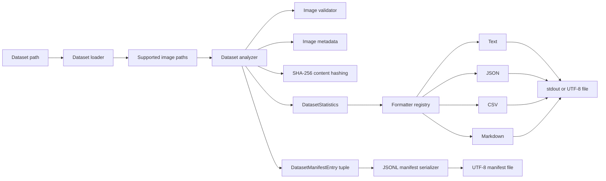
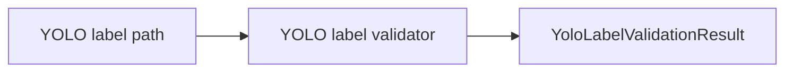
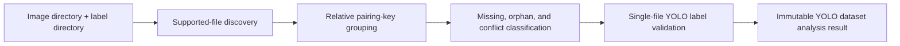
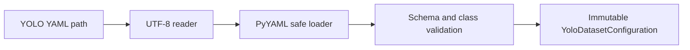

# Architecture

## High-level architecture

Poseidon AI is organized as a Python package under `src/poseidon_ai`.
Nautilus Vision is the implemented computer-vision and dataset-engineering
component. Its dataset path is deliberately split into discovery, validation,
metadata extraction, aggregation, and presentation.



YOLO label validation is a separate library flow:



YOLO dataset analysis composes discovery and the single-file validator in a
second independent library flow:



YOLO dataset configuration is a third independent library flow:



The image dataset-reporting flow in words: the CLI accepts a dataset
directory, the loader returns supported candidate paths, the analyzer
validates each path and collects metadata for valid images. It hashes only same-size valid candidates
for exact duplicate detection. The aggregate-only API returns statistics,
while the manifest API also finalizes relative per-candidate entries from the
same pass. A selected formatter renders the aggregate result for standard
output or a file, and the manifest serializer writes JSONL when requested.

## Component responsibilities

### Dataset loader

`nautilus_vision/dataset_loader.py` checks that the dataset path exists and is
a directory. It discovers regular files with supported suffixes and returns
them in deterministic, case-insensitive relative-path order. The loader API
supports both recursive and non-recursive discovery plus optional validation.
The dataset-summary CLI keeps non-recursive discovery as its default and
exposes recursive discovery through `--recursive`.

### Image validator

`nautilus_vision/image_validator.py` checks:

- path existence;
- membership in the supported-extension set;
- whether OpenCV can decode the file;
- minimum width and height, both 32 pixels by default.

`DEFAULT_MIN_WIDTH` and `DEFAULT_MIN_HEIGHT` define those shared defaults.
Callers can supply independent threshold values, while dimension checks and
their ordered validation errors remain owned by the image validator.

It returns an `ImageValidationResult` containing validity, error messages,
and decoded dimensions and channel count when available.

### YOLO label validator

`nautilus_vision/yolo_label.py` owns parsing and validation for one UTF-8 YOLO
detection-label file. It is independent of the image dataset analyzer and is
not used by the dataset-summary CLI. Parsing performs no image decoding,
dataset traversal, or image-label pairing.

`YoloDetectionAnnotation` and `YoloLabelValidationResult` are frozen and
slotted. Annotations preserve source order and physical one-based line
numbers. Errors preserve source-line order and YOLO field order. Valid
annotations remain available when another line is invalid, and an empty label
file is valid. Training and inference remain unimplemented.

### YOLO dataset analyzer

`nautilus_vision/yolo_dataset.py` owns library-level pairing and aggregation
for explicit image and label roots. Supported-image discovery reuses
`load_image_dataset(..., validate=False)` and therefore the existing
case-insensitive supported-extension definition without decoding or
validating image contents. Label discovery accepts case-insensitive `.txt`
suffixes.

Pairing keys are case-sensitive root-relative POSIX paths with only the final
extension removed. Multiple images or labels under one key create an
immutable conflict; the analyzer never selects one arbitrarily. Missing-label
images, orphan labels, conflicts, and ordinary pairs are mutually exclusive
classifications. Only uniquely paired labels are passed to
`validate_yolo_label()`, exactly once each.

Fully valid paired labels contribute to aggregate annotation and numeric
per-class counts. Partial annotations retained by an invalid label result
remain inspectable through its pair but are excluded from aggregates. Empty
valid labels count as valid and empty while contributing zero annotations.
All public dataset-analysis models are frozen and slotted, and all public
collections use deterministic immutable tuples.

This analyzer remains separate from `dataset_analyzer.py`. It does not change
the dataset-summary CLI, any text, JSON, CSV, or Markdown report schema, or
the JSONL image manifest.

### YOLO dataset-configuration validator

`nautilus_vision/yolo_config.py` owns strict parsing and validation for one
YOLO dataset YAML file. PyYAML's `safe_load` is the only YAML parsing boundary;
unsafe and unsupported tags produce the generic invalid-YAML result rather
than constructing Python objects.

The component constructs dataset-root and split `Path` values without
resolution, expansion, existence checks, or traversal. It normalizes list or
contiguous integer-keyed mapping names into ordered immutable
`YoloClassDefinition` values. A valid optional `nc` declaration is checked
against the class tuple but is not stored redundantly; the configuration's
`number_of_classes` property derives the value.

Unknown top-level metadata is ignored. Invalid results expose deterministic
immutable errors and no partial public configuration. All public models are
frozen and slotted.

Configuration validation remains separate from `yolo_dataset.py`: it neither
invokes image-label analysis nor orchestrates configured splits. Split-level
analysis, observed-versus-configured class validation, and training-readiness
assessment remain future work. The dataset-summary CLI and JSONL image
manifest are unchanged.

### Image metadata utilities

`nautilus_vision/image_metadata.py` decodes one image and returns its
filename, width, height, channel count, and on-disk byte size.
`nautilus_vision/image_loader.py` provides the lower-level operation that
loads an image into a NumPy array. Both raise `FileNotFoundError` when OpenCV
cannot load the requested image.

### Image hashing

`nautilus_vision/image_hash.py` calculates lowercase SHA-256 content digests
by reading files incrementally in binary chunks. It performs no image
decoding, does not load complete files into memory, and preserves normal
filesystem exceptions.

### Dataset analyzer

`nautilus_vision/dataset_analyzer.py` coordinates discovery and validation.
It counts every supported candidate, normalizes and counts its extension,
then aggregates total, valid, invalid, total-valid-byte, and
average-valid-byte statistics for each normalized format. It records
invalid-image diagnostics and collects size and dimension data for valid
images. It also aggregates the decoded channel count already present in
each valid image's metadata. From the same metadata result, it calculates
each valid image's actual `width * height` pixel area and aggregates minimum,
maximum, and arithmetic mean pixel counts. It also calculates each unrounded
`width / height` aspect ratio and classifies orientation by exact integer
comparison as landscape, portrait, or square. These statistics use the
metadata already collected for valid images and add no metadata request or
image decode. No EXIF orientation is read or interpreted. Its keyword-only
minimum width and height default to the validator constants and are forwarded
directly to `validate_image`.

The public `analyze_dataset` API preserves its
`DatasetStatistics` return contract. `analyze_dataset_with_manifest` returns
a `DatasetAnalysisResult` containing those statistics and an immutable tuple
of manifest entries. Both delegate to one private analysis implementation,
so manifest export does not repeat discovery, validation, metadata
extraction, image decoding, or candidate hashing. Aggregate-only calls do not
retain per-candidate manifest records.

`total_size_bytes` is the sum of valid-image file sizes. The analyzer also
aggregates minimum, maximum, and arithmetic mean valid-image file sizes. Each
value comes from the `size_bytes` already present in that image's metadata;
the same value feeds the total, file-size statistics, duplicate-size bucket,
per-format valid bytes, and optional manifest entry. This adds no filesystem
stat, metadata request, validation, decode, hash, or traversal. Invalid
candidates still contribute to `total_images`, `extension_counts`, and
per-format total and invalid counts, but not to per-format valid counts or
bytes, channel, resolution, aspect-ratio, orientation, or file-size
statistics. They also never participate in duplicate hashing. Exact
duplicate members remain separate valid candidates and each contributes its
own size to both global and per-format statistics.

For exact duplicates, the analyzer first buckets valid paths by metadata file
size. Unique-size files are not hashed. Files in same-size buckets are hashed
once each and grouped only when their complete SHA-256 digests match; matching
size alone is never sufficient. Paths and completed groups use deterministic
portable-path ordering. Recursive discovery and validation thresholds
therefore control duplicate eligibility without adding traversal logic or
another image decode.

After duplicate groups are complete, the analyzer derives a relative
path-to-digest mapping from actual group members and uses it to finalize the
frozen manifest entries. Same-size non-duplicates and unique files never
receive a digest. Entries are sorted by relative POSIX-style path using
case-insensitive then case-sensitive ordering.

### `DatasetStatistics`

`nautilus_vision/dataset_statistics.py` defines the mutable aggregate passed
from analysis to presentation. It contains dataset identity, valid and
invalid counts, dimensions, valid-image bytes, normalized extension counts,
immutable per-format aggregates, numeric decoded channel counts for valid
images, and invalid-image diagnostics. It also retains raw minimum, maximum,
and average valid-image
pixel counts, aspect ratios, and file sizes, plus ordered lowercase
orientation counts and immutable exact-duplicate groups containing a
lowercase SHA-256 digest and a tuple of `Path` objects. Group,
participating-file, and redundant-copy counts are derived properties rather
than mutable state. Rounded aspect ratios, formatted file sizes, megapixel
values, and per-file hashes are not duplicated in the model.
Collection fields use independent default factories. The model keeps channel
keys as integers and does not attach inferred colour semantics.

Per-candidate inventory data is deliberately not stored in
`DatasetStatistics`, which remains aggregate-only.

### `ImageFormatStatistics`

`ImageFormatStatistics` is a frozen, slotted value model for one normalized
extension. It stores total, valid, and invalid candidate counts plus total and
average bytes from valid images. It stores neither paths nor formatted sizes.
`DatasetStatistics.format_statistics` maps normalized lowercase extensions to
these values with an independent dictionary default. `extension_counts`
remains the backward-compatible total-count representation, while bare
manually constructed statistics may leave the richer mapping empty.

### Dataset manifest

`nautilus_vision/dataset_manifest.py` defines the immutable
`DatasetManifestEntry` and `DatasetAnalysisResult` value models. Each manifest
entry represents one supported candidate with a dataset-relative `Path`, its
normalized extension, validity and ordered errors, optional valid-image
metadata, and optional completed duplicate-group SHA-256 digest. Invalid
entries use null metadata during serialization. No absolute path, timestamp,
machine identity, semantic colour label, or unique-file hash is retained.

The same module serializes entries as JSON Lines with one compact object per
line, exact stable key order, forward-slash relative paths, and a terminal
newline for non-empty output. JSONL keeps individual records independently
parseable and is suitable for deterministic line-oriented processing. An
empty candidate tuple serializes to an empty file.

Aspect-ratio, orientation, aggregate file-size, and per-format statistics do
not change this eleven-key manifest schema. Entries already expose their
normalized extension, and valid entries expose decoded width and height and
their metadata `size_bytes`, so consumers can inspect per-file inputs without
duplicating aggregate concerns in each entry.

### `DuplicateImageGroup`

`DuplicateImageGroup` is an immutable value containing one exact-content
SHA-256 digest and at least two deterministically ordered valid-image paths.
Analyzer-produced statistics never retain single-file hash groups.

### `InvalidImageDiagnostic`

`InvalidImageDiagnostic` is an immutable value with an image `Path` and a
tuple of validation error strings. The analyzer creates one entry for each
invalid supported candidate. Report formatters expose the portable image path
and all captured errors without reading or validating the image again.

### Text and JSON formatters

`nautilus_vision/dataset_summary.py` contains the human-readable text
formatter and JSON formatter. Text uses uppercase image-format labels and a
per-format statistics section followed by numeric Image Channels, Image
Resolution, Image Aspect Ratios, Image File Sizes, and diagnostics grouped
under portable paths and a formatted size. An Exact Duplicate Images section
appears between file sizes and diagnostics. JSON preserves normalized
lowercase extension keys, converts
numerically ordered channel keys to strings, includes structured pixel,
megapixel, aspect-ratio, orientation, file-size, and exact-duplicate data plus
raw and formatted total sizes, and represents diagnostics as explicit
dictionaries with error arrays.

### Shared dataset serialization

`nautilus_vision/dataset_serialization.py` provides the shared deterministic
structures used by JSON and CSV. Resolution serialization retains raw pixel
counts and derives decimal megapixels using `pixel_count / 1_000_000`, rounded
to six decimal places. Aspect-ratio serialization rounds the already
aggregated ratios to six decimal places and always emits landscape, portrait,
and square counts in that order. File-size serialization preserves integer
minimum and maximum byte counts and rounds the arithmetic mean to two decimal
places. Per-format serialization sorts normalized extensions, preserves its
five stable fields and numeric types, and rounds average valid bytes to two
decimal places. Duplicate serialization derives counts, converts paths to
portable strings, and preserves deterministic group and path ordering. It
does not mutate `DatasetStatistics`.

### CSV formatter

`nautilus_vision/dataset_csv.py` uses `csv.writer` and `io.StringIO`. It has a
stable nineteen-column schema. The `extension_counts`, `format_statistics`,
`channel_counts`, `resolution_statistics`, `aspect_ratio_statistics`,
`file_size_statistics`, and `duplicate_images` cells are JSON objects.
`invalid_image_diagnostics` is a JSON array in one cell. They are serialized
with `json.dumps`, so formats do not create dynamic columns and commas and
quotation marks are correctly escaped.

### Markdown formatter

`nautilus_vision/dataset_markdown.py` renders Overview, Image Formats, Image
Format Statistics, Image Channels, Image Resolution, Image Aspect Ratios,
Image File Sizes, Exact Duplicate Images, Invalid Image Diagnostics, Width,
Height, and Dataset Size sections.
Duplicate and diagnostic paths use portable separators and safe code-span
delimiters, and error bullets escape Markdown punctuation.

### Formatter registry

`FORMATTER_REGISTRY` in `dataset_summary.py` maps `text`, `json`, `csv`, and
`markdown` to callables with the same `(Path, DatasetStatistics) -> str`
contract. The registry is also the source for argparse's `--format` choices.

### CLI entry module

`dataset_summary.main` is exposed through the installed
`poseidon-dataset-summary` command. The equivalent
`python -m poseidon_ai.nautilus_vision.dataset_summary` invocation remains
supported. Both paths call the same `main()` function and therefore share
argument parsing, formatting, operational error handling, and exit-code
behavior.

The CLI parses the dataset path, output format, legacy `--json` shortcut,
optional aggregate output path, and optional `--manifest-output` path. Its
`--recursive` boolean is passed directly to the analyzer, which delegates
discovery to the loader; the CLI contains no separate traversal
implementation. The CLI also parses positive
`--min-width` and `--min-height` values and forwards them to the analyzer; it
does not perform dimension validation itself. Without manifest output it uses
`analyze_dataset`; with manifest output it uses the combined analyzer once,
writes the JSONL file, then prints or writes the selected aggregate report.
When both output paths are present, both files are written and stdout remains
empty. Loaders and analyzers retain normal Python exception semantics for
library callers. At the CLI boundary, expected dataset, aggregate-output, and
manifest-output filesystem failures are translated into concise standard
error messages and status 1. Parent directories are not created, aggregate
stdout is suppressed after a manifest failure, and unexpected programming
failures are not broadly swallowed.

The installed `poseidon-inspect` command is separate and inspects metadata for
one image.

## Why validation and analysis are separate

Validation answers whether an individual image meets current input rules and
returns specific errors. Analysis owns dataset-wide decisions: it discovers
candidates, updates counts, captures invalid diagnostics, and aggregates
metadata. This boundary allows validation to be used independently and keeps
dataset arithmetic out of the image-level validator.

## Why reporting formats are isolated

Analysis produces one structured model. Formatters translate that model
without rediscovering or revalidating files. Isolated formatters keep
presentation-specific concerns—JSON types, CSV escaping, Markdown tables,
and text alignment—out of the analysis path and allow the CLI registry to
select a format consistently. Diagnostic reporting reads the structured
analysis result; it never performs a second validation pass. Channel
statistics likewise use metadata already collected for valid images and do
not trigger another decode. Resolution statistics use that same metadata
result and derive presentation-only megapixels from the model's raw pixel
counts. Aspect-ratio statistics also use that result, aggregate unrounded
ratios, and compare integer dimensions directly for orientation. File-size
statistics reuse the metadata byte count that also feeds `total_size_bytes`,
duplicate bucketing, per-format valid bytes, and manifest entries; they do not
stat files again. Per-format aggregation reuses the extension already
normalized for `extension_counts` and the same validation result. Exact
duplicate reporting reads analyzer-produced groups and never rehashes files.

Manifest serialization reads the combined analyzer result. It does not
change any aggregate formatter contract or text, JSON, CSV, or Markdown
schema.

## Analyzer invariants

For statistics returned by `analyze_dataset`, the following relationships are
expected:

```text
total_images == valid_images + invalid_images
sum(extension_counts.values()) == total_images
set(format_statistics) == set(extension_counts)
sum(item.total_images for item in format_statistics.values()) == total_images
sum(item.valid_images for item in format_statistics.values()) == valid_images
sum(item.invalid_images for item in format_statistics.values())
    == invalid_images
sum(item.total_valid_size_bytes for item in format_statistics.values())
    == total_size_bytes
all(
    item.total_images == item.valid_images + item.invalid_images
    for item in format_statistics.values()
)
sum(channel_counts.values()) == valid_images
sum(orientation_counts.values()) == valid_images
set(orientation_counts) == {"landscape", "portrait", "square"}
len(invalid_image_diagnostics) == invalid_images
all(
    len(group.image_paths) >= 2
    for group in duplicate_image_groups
)
duplicate_group_count == len(duplicate_image_groups)
duplicate_file_count
    == sum(len(group.image_paths) for group in duplicate_image_groups)
redundant_copy_count
    == sum(len(group.image_paths) - 1 for group in duplicate_image_groups)
redundant_copy_count
    == duplicate_file_count - duplicate_group_count
```

When valid images exist, resolution, aspect-ratio, and file-size statistics
also satisfy:

```text
min_pixel_count <= average_pixel_count <= max_pixel_count
average_pixel_count
    == sum(width * height for every valid image) / valid_images
min_aspect_ratio <= average_aspect_ratio <= max_aspect_ratio
min_aspect_ratio > 0
average_aspect_ratio
    == sum(width / height for every valid image) / valid_images
min_file_size_bytes > 0
min_file_size_bytes <= average_file_size_bytes <= max_file_size_bytes
average_file_size_bytes == total_size_bytes / valid_images
all(
    item.average_valid_size_bytes
        == item.total_valid_size_bytes / item.valid_images
    for item in format_statistics.values()
    if item.valid_images > 0
)
all(
    item.total_valid_size_bytes == 0
    and item.average_valid_size_bytes == 0.0
    for item in format_statistics.values()
    if item.valid_images == 0
)
```

These invariants are analyzer behavior, not validation enforced by the
`DatasetStatistics` dataclass. Callers can manually construct a statistics
object whose fields do not satisfy them.

When no valid images exist, channel counts are empty, all width, height,
pixel-count, aspect-ratio, and file-size statistics remain zero, all three
analyzer orientation categories have zero counts, and `total_size_bytes` is
zero.
Minimum and maximum pixel counts come from actual per-image areas; the
analyzer never combines independent width and height extrema to fabricate an
area. Channel values describe decoded array channel counts from the current
metadata pipeline, not inferred colour modes. Aspect ratios are not rounded
before aggregation, and orientation is not inferred from ratios, filenames,
or EXIF data. Duplicate members each contribute their own metadata byte count
to the file-size statistics, per-format statistics, and total.

## Extension normalization

Candidate suffix matching is case-insensitive. The analyzer removes the
leading dot, lowercases the suffix, maps `jpg` to `jpeg` and `tif` to `tiff`,
then sorts the completed mapping by normalized key. Machine-readable reports
retain those lowercase keys. Text and Markdown uppercase them for display.

## Current limitations

- Dataset size excludes invalid supported files.
- Duplicate detection is byte-exact; visually similar, resized, recompressed,
  re-encoded, cropped, or metadata-modified images are not detected unless
  their complete bytes match.
- Configured split paths are not orchestrated automatically, and observed
  annotation class IDs are not compared with configured classes.
- There is no training-readiness assessment or YOLO configuration CLI.
- Segmentation, pose, and oriented-box annotations are not supported.
- There is no label-analysis CLI.
- There is no model-training, inference, video, or live-camera pipeline.

## Planned architectural direction

Planned work is tracked in the [roadmap](roadmap.md). Near-term directions
include richer dataset statistics. Training and inference remain future
capabilities rather than part of the current architecture.
